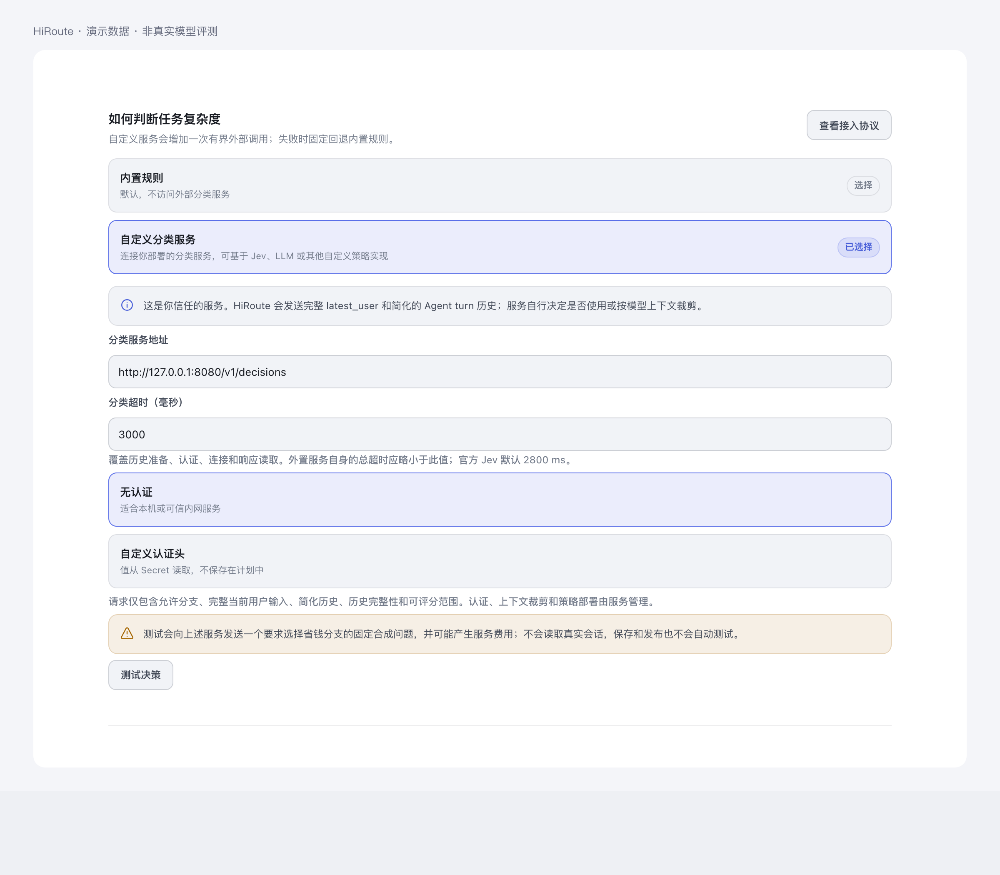
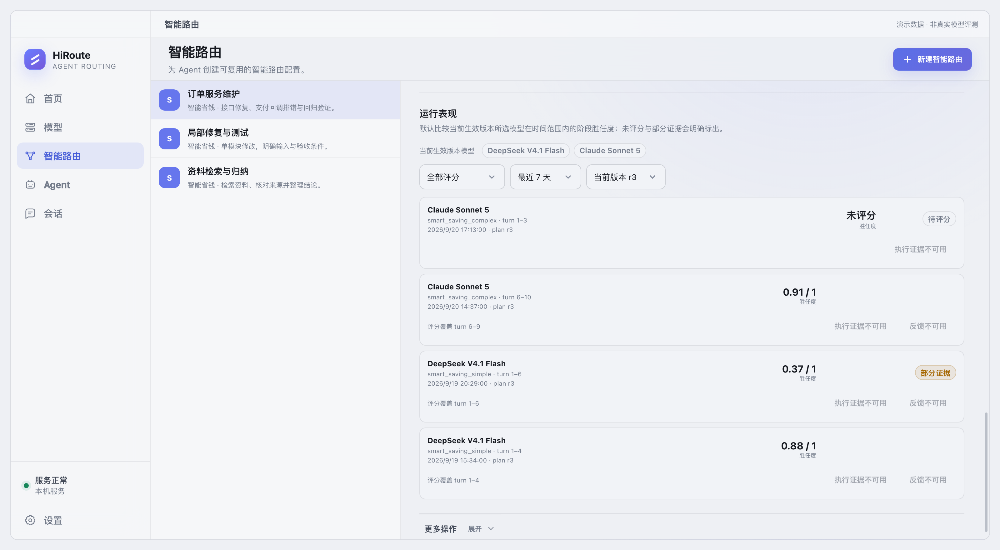

# HiRoute 决策扩展

[English](README.md) · [决策 API](api/README.zh-CN.md) · [官方 Jev 扩展](extensions/jev-decider/README.zh-CN.md)

HiRoute 可以在新的路由执行轮次开始时，请求一个受信任的决策服务选择执行分支，同时让服务评价上一执行阶段的模型胜任度。这是一套通用的分支选择与评分协议，不限定简单/复杂二分类。当前智能省钱产品入口提供两个分支；协议的 `branches` 映射和 Jev 扩展的 `auto` 模式可以处理多个允许分支，但这不意味着当前界面已经新增任意多分支路由模式。

## 接入官方扩展

按[部署说明](extensions/jev-decider/README.zh-CN.md)启动 Jev 服务，它每次决策只请求一次 OpenRouter。在智能省钱计划中选择自定义分类服务，填写完整地址 `http://127.0.0.1:8080/v1/decisions`、超时和可选认证头，显式测试后发布。保存和发布不会自动调用决策服务。



本文截图由真实产品组件与模拟数据生成，均不代表真实模型评测；[插图证据边界](#illustration-evidence-boundaries)说明了这些图片能够证明什么。

## 模型切换发生在什么边界

```text
无可继承决策 / 追加用户输入 / ContextHold 无保持
  → 选择分支，同时可评价上一阶段
  → ContextHold 有效期间的模型请求继承该分支
  → 下一决策边界封存当前路由执行轮次
```

没有可继承决策、ContextHold 已证明延续的历史追加了真实用户输入，或 ContextHold 不再提供候选保持时，HiRoute 都会决策一次；不会让服务识别压缩，也不要求最新用户文本变化。有保持、有决策且没有追加用户输入的请求重放或工具续轮复用已冻结分支。候选模型不可用时仍可按计划进行故障接力，这属于执行兜底。若接受的输出全部来自另一兜底分支，历史会记录实际执行分支；混合模型贡献不能冒充某个单一模型的胜任度。

一个路由执行轮次包含一次决策及其后继承该决策的模型请求，一个用户任务可以跨多个轮次。计划版本、选择/实际分支、实际模型配置或有效 profile 在真实执行中变化时开启新阶段；实际身份不变的连续轮次仍属同一阶段，仅凭据轮换不切阶段。HiRoute 内部保存模型归属，决策协议不必在每个 step 重复模型信息。

## HiRoute 和决策服务各做什么

| HiRoute | 决策服务 |
| --- | --- |
| 允许分支、决策边界、真实执行与兜底 | 选择策略、提示词和上游模型调用 |
| 完整当前用户投影、内存中保留的执行轮次历史 | 根据自身模型限制选择与裁剪上下文 |
| 期限、取消、外部服务失败后的本地规则回退 | 部署、上游凭据和可选入站认证 |
| 评分目标、模型/计划归属、阶段最新评分持久化 | 可选胜任度评分和真实的 partial 标记 |

历史保留执行轮次开始时的用户内容、被 HiRoute 接受的回答，以及工具名称、顺序和粗粒度状态；不发送工具参数和输出、系统指令或推理内容。仅因进入下一决策边界而封存的轮次可以是 `unknown`，不代表成功或失败。内存历史可能因淘汰、重启或捕获缺口而不完整，客户端替换历史本身不造成缺口。当前用户投影始终来自实际请求且非空，可以与上一轮相同或是客户端生成的摘要/继续消息；它不会因固定分类字节预算被截断。不能呈现的非文本内容用不可用标记表达。字段和失败语义见 [API 说明](api/README.zh-CN.md)。

## 用胜任度改进智能路由与任务委派

**胜任度只负责阻止冒险降本，复杂度负责提供降本机会。** 这是官方扩展 `rules` 模式的原则；另一种 `auto` 模式由 Jev 直接选分支。两者都可以结合当前 `latest_user` 和之前的执行表现评价上一阶段。用户明确指出“仍然没修好”可以成为评分证据；重复文本、摘要、继续消息或没有反馈本身不等于表扬或不满。

`[0,1]` 评分表达模型对该阶段任务的胜任程度，不是置信度、任务复杂度、统计成功率或全局能力排名。同阶段新的合法评分覆盖旧值；不返回评分则保留旧值，未评分不等于零。查看评分时要同时看 `partial` 和已评分范围，阶段继续执行后旧评分不一定覆盖新增执行轮次。如果之后没有新的决策边界，最后阶段也可能没有最终评分。



图中以“订单服务维护”计划的四个独立会话为例，使用实际模型名称和模拟的分数、时间。保留未评分、部分历史和最新轮次尚未被评分覆盖的状态，不代表真实模型能力对比；这组 Jev 示例不虚构文字评分理由。

计划的“运行表现”自动展示当前生效版本所选模型在指定时间范围内的阶段评分，无需输入内部模型 ID。会话的“模型表现”展示阶段与可用证据。


获得授权的主 Agent 可以通过同一 CLI 查询低分或高分阶段，再结合保留的会话证据分析任务委派效果：

```sh
hiroute observation plan-quality samples --plan-id plan/code-maintenance --score-lt 0.5 --output json
hiroute observation plan-quality samples --plan-id plan/code-maintenance --score-gt 0.8 --output json
```

示例计划 ID 需要替换为实际 ID。分数上下界都是严格比较，未评分记录不匹配分数过滤；还可按会话、计划版本、精确模型、时间筛选并分页。证据读取遵守现有内容保留与授权规则。

例如，多条证据显示经济模型能胜任局部修复，却经常无法完成跨模块改造。主 Agent 可以据此建议拆出更专门的“局部修复”计划，让经济模型承担边界清晰的子任务，把更广的任务委派给更强模型，再观察后续表现。应结合任务差异、版本、部分证据和多个样本判断；HiRoute 当前不自动建计划、训练选择器或根据单次低分否定某模型。

## 自行实现策略

基于 Jev、LLM 或自己的规则实现[五字段 HTTP JSON 协议](api/README.zh-CN.md)，返回允许的分支以及可选的上一阶段评分即可。供应商协议适配和模型上下文限制由服务内部负责。[官方扩展](extensions/jev-decider/README.zh-CN.md)提供可部署实现和真实 HTTP 入口的离线测试，供二次开发参考。

<span id="illustration-evidence-boundaries"></span>

## 插图证据边界

配置与运行表现图片来自当前 HiRoute 产品组件，填充的是模拟计划、会话、评分和时间。它们用于说明本文描述的布局与状态，不是原生 WebView 验收证据、真实 Jev 响应或模型能力对比基准。产品与供应商验证仍以绑定精确提交的测试证据为准，不能从这些插图反推。
